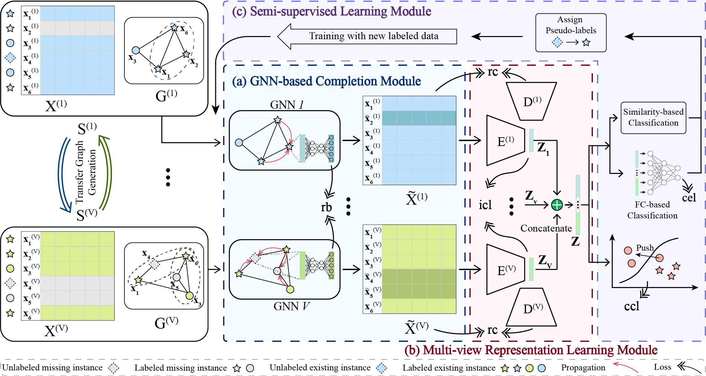

# Deep Incomplete Multi-View Learning Network with Insufficient Label Information
This repo contains the code of our AAAI24 paper *Deep Incomplete Multi-View Learning Network with Insufficient Label Information*. To tackle the double missing of features and labels problem, we propose a novel Deep Incomplete Multi-view Learning Network (DIMvLN) by incorporating graph networks and semi-supervised learning in this paper.



## Requirements
- scikit-learn==1.1.1
- scipy==1.8.1
- torch==1.12.0+cu116
- torch-cluster==1.6.0+pt112cu116

## Content

- `classification.py`: Main function to run incomplete multi-view semi-supervised classification.
- `config/config_with_gcn_completion.py`: contains the hyper-parameters (e.g., $\alpha$ and $\lambda_1$) and the training options (e.g., structure of network and learning rate).
- `models/model.py`: Class of the DIMvLN can tackle the dataset with 2 to 6 views.
- `models/model_coach.py`: Class of the pipeline to run the training process.

## Usage

Before you start the experiment, please make sure that the constant `MAIN_DIR` in the `models/utils/data_loader.py` script points to the path of the parent folder of the `data` folder.

To run the incomplete multi-view semi-supervised classification with missing rate=50% and unlabeled rate={95%, 90%, 85%}, simply type:

``````
>> cd <Path_to_DIMvLN_code_folder>
>> python classification.py --dataset 0 --device 0 --info_freq 20 --test_time 10 --missing_rate 0.5 --unlabeled_rate 0.95,0.9,0.85 --save_result y
``````

where `--dataset` is the selected dataset index; `--info_freq` means the information update frequency; `--test_time` means the number of independent runs.

``````
Start pre-train GCN...
pre_train_loss in 0: 0.4602
pre_train_loss in 1: 0.3740
pre_train_loss in 2: 0.3520
pre_train_loss in 3: 0.3194
...
Epoch
**********************
 1/200    Train: L_rc==>1.0239 L_icl==>-0.0053 L_ccl==>0.3493 L_cel==>2.2867 ACC==>0.473 || Validation: Loss==>0.0000 ACC==>0.505
 20/200   Train: L_rc==>0.2678 L_icl==>-0.0053 L_ccl==>0.8352 L_cel==>0.0105 ACC==>0.835 || Validation: Loss==>0.0000 ACC==>0.809
 40/200   Train: L_rc==>0.2703 L_icl==>-0.0053 L_ccl==>0.8783 L_cel==>0.0066 ACC==>0.948 || Validation: Loss==>0.0000 ACC==>0.903
 ...
 180/200  Train: L_rc==>0.2610 L_icl==>-0.0053 L_ccl==>0.8835 L_cel==>0.0001 ACC==>0.999 || Validation: Loss==>0.0000 ACC==>0.948
 200/200  Train: L_rc==>0.2612 L_icl==>-0.0053 L_ccl==>0.8940 L_cel==>0.0001 ACC==>0.999 || Validation: Loss==>0.0000 ACC==>0.942
**********************
>>>>> Best validation Accuracy score:
     0.9502617801047121 best_acc
>>>>> Test(1/10) Report with best validation Accuracy model parameters:
Accuracy score:  0.9205020920502092
Macro-Precision score:  0.8545993164857755
Macro-F1 score:  0.8227701485690322
``````
